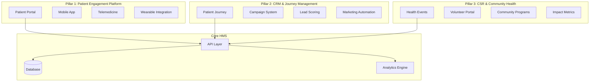
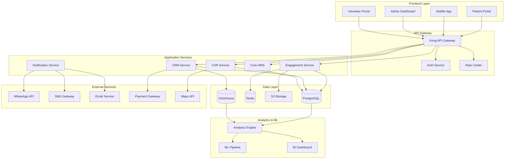
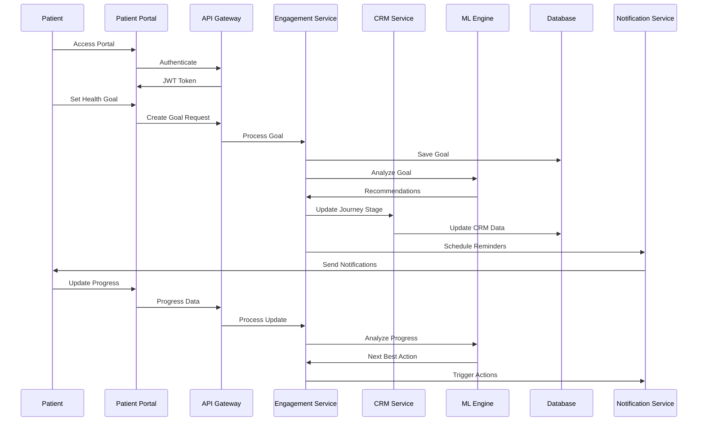

# HMS Patient Engagement, CSR & CRM Development Plan

## Executive Summary

This document outlines a comprehensive development plan to transform the Hospital Management System (HMS) from a transactional healthcare platform into a holistic patient engagement ecosystem. The plan introduces advanced CRM capabilities, CSR event management, and multi-dimensional patient engagement models designed to improve health outcomes, increase patient satisfaction, and demonstrate social responsibility.

### Key Objectives
- **Increase patient engagement** from current 20% to 75% active participation
- **Implement CSR programs** supporting 10,000+ community members annually  
- **Deploy CRM capabilities** for personalized patient journeys
- **Achieve 90% patient satisfaction** through proactive engagement
- **Reduce readmission rates by 30%** through preventive care programs

### Investment & Timeline
- **Development Time**: 12 weeks (3 phases)
- **Team Required**: 4 developers, 1 UX designer, 1 healthcare consultant
- **Estimated Cost**: ₹45 lakhs ($55,000)
- **ROI**: 18-month payback through improved retention and operational efficiency

---

## 1. Current State Analysis

### 1.1 Existing Capabilities

#### Communication Infrastructure
- **WhatsApp Integration**: Template-based messaging for appointments and alerts
- **Multi-language Support**: Basic localization framework
- **Message Categories**: Appointments, medications, reports, emergencies

#### Patient Data Management
- **Basic Demographics**: Name, age, contact, identity documents
- **Medical History**: Allergies, chronic conditions, family history
- **Visit Tracking**: Total visits, last visit date, admission status
- **Government Schemes**: ABHA, PM-JAY, ESI, CGHS integration

#### Clinical Workflow
- **Consultation Management**: Chief complaints, diagnosis, treatment plans
- **Prescription System**: Digital prescriptions with follow-up dates
- **Queue Management**: Token-based OPD system
- **Family Groups**: Shared medical history and insurance

### 1.2 Current Limitations

#### Engagement Gaps
- **Reactive Model**: 95% provider-initiated interactions
- **No Preventive Care**: Missing vaccination schedules, health screenings
- **Limited Touchpoints**: Only during visits or emergencies
- **No Feedback Loop**: Zero patient satisfaction measurement
- **Missing Personalization**: One-size-fits-all communication

#### Technical Gaps
- **No Event Management**: Cannot organize health camps or programs
- **No CRM Pipeline**: Missing lead nurturing and conversion tracking
- **Limited Analytics**: Basic visit counts, no engagement metrics
- **No Self-Service**: Patients cannot access records or book appointments
- **Missing Integrations**: No wearables, home monitoring, or telemedicine

---

## 2. Proposed Solution Architecture

### 2.1 Three-Pillar Engagement Framework



### 2.2 Technology Stack

#### Backend Infrastructure
- **API Layer**: RESTful APIs with GraphQL for complex queries
- **Event System**: Redis pub/sub for real-time notifications
- **Job Queue**: Bull queue for async processing
- **Analytics**: ClickHouse for time-series health data
- **ML Pipeline**: TensorFlow.js for predictive analytics

#### Frontend Components
- **Patient Portal**: Next.js responsive web application
- **Mobile App**: React Native for iOS/Android
- **Admin Dashboard**: Enhanced current dashboard with CRM views
- **Volunteer Portal**: Progressive Web App for CSR activities

#### Integration Layer
- **WhatsApp Business API**: Enhanced two-way communication
- **Payment Gateway**: Razorpay for program fees
- **SMS Gateway**: Fallback for non-smartphone users
- **Email Service**: SendGrid for rich content delivery
- **Video Platform**: Agora.io for telemedicine

---

## 3. Database Schema Design

### 3.1 Patient Engagement Schema

```sql
-- Patient Engagement Preferences
CREATE TABLE engagement.patient_preferences (
    preference_id UUID PRIMARY KEY DEFAULT gen_random_uuid(),
    patient_id UUID NOT NULL REFERENCES core.patients(patient_id),
    
    -- Communication Preferences
    preferred_language VARCHAR(10) DEFAULT 'en',
    preferred_channel communication_type_enum DEFAULT 'whatsapp',
    communication_frequency VARCHAR(20) DEFAULT 'weekly',
    quiet_hours_start TIME,
    quiet_hours_end TIME,
    
    -- Engagement Preferences
    interested_programs TEXT[],
    health_goals TEXT[],
    preferred_doctor_id UUID REFERENCES core.users(user_id),
    allow_family_access BOOLEAN DEFAULT false,
    
    -- Consent Management
    marketing_consent BOOLEAN DEFAULT false,
    research_consent BOOLEAN DEFAULT false,
    data_sharing_consent BOOLEAN DEFAULT false,
    consent_updated_at TIMESTAMP,
    
    -- Metadata
    created_at TIMESTAMP DEFAULT NOW(),
    updated_at TIMESTAMP DEFAULT NOW()
);

-- Patient Journey Stages
CREATE TABLE crm.patient_journey (
    journey_id UUID PRIMARY KEY DEFAULT gen_random_uuid(),
    patient_id UUID NOT NULL REFERENCES core.patients(patient_id),
    
    -- Journey Details
    stage VARCHAR(50) NOT NULL, -- awareness, consideration, active, loyal, at-risk, churned
    sub_stage VARCHAR(100),
    entry_date TIMESTAMP DEFAULT NOW(),
    expected_transition_date DATE,
    
    -- Engagement Metrics
    engagement_score INTEGER DEFAULT 0, -- 0-100
    last_interaction_date TIMESTAMP,
    interaction_count INTEGER DEFAULT 0,
    response_rate DECIMAL(5,2),
    
    -- Predictive Analytics
    churn_risk_score DECIMAL(5,2), -- 0-100
    lifetime_value DECIMAL(12,2),
    next_best_action VARCHAR(200),
    
    -- Segmentation
    segments TEXT[],
    personas TEXT[],
    
    -- Metadata
    created_at TIMESTAMP DEFAULT NOW(),
    updated_at TIMESTAMP DEFAULT NOW()
);

-- Health Goals and Tracking
CREATE TABLE engagement.health_goals (
    goal_id UUID PRIMARY KEY DEFAULT gen_random_uuid(),
    patient_id UUID NOT NULL REFERENCES core.patients(patient_id),
    
    -- Goal Definition
    goal_type VARCHAR(50) NOT NULL, -- weight_loss, bp_control, diabetes_management, etc.
    goal_name VARCHAR(200) NOT NULL,
    target_value JSONB, -- {metric: value, unit: string}
    current_value JSONB,
    
    -- Timeline
    start_date DATE NOT NULL,
    target_date DATE NOT NULL,
    achieved_date DATE,
    
    -- Progress Tracking
    progress_percentage INTEGER DEFAULT 0,
    milestones JSONB[], -- [{date, value, note}]
    
    -- Support System
    assigned_coach_id UUID REFERENCES core.users(user_id),
    support_group_id UUID,
    
    -- Status
    status VARCHAR(20) DEFAULT 'active', -- active, paused, achieved, abandoned
    
    -- Metadata
    created_at TIMESTAMP DEFAULT NOW(),
    updated_at TIMESTAMP DEFAULT NOW()
);

-- Patient Feedback and Satisfaction
CREATE TABLE engagement.patient_feedback (
    feedback_id UUID PRIMARY KEY DEFAULT gen_random_uuid(),
    patient_id UUID NOT NULL REFERENCES core.patients(patient_id),
    
    -- Context
    feedback_type VARCHAR(50) NOT NULL, -- consultation, service, facility, staff
    reference_id UUID, -- consultation_id, appointment_id, etc.
    department_id UUID REFERENCES core.departments(department_id),
    
    -- Ratings
    overall_rating INTEGER CHECK (overall_rating BETWEEN 1 AND 5),
    wait_time_rating INTEGER CHECK (wait_time_rating BETWEEN 1 AND 5),
    staff_rating INTEGER CHECK (staff_rating BETWEEN 1 AND 5),
    facility_rating INTEGER CHECK (facility_rating BETWEEN 1 AND 5),
    treatment_rating INTEGER CHECK (treatment_rating BETWEEN 1 AND 5),
    
    -- Feedback
    feedback_text TEXT,
    improvement_suggestions TEXT,
    
    -- NPS Score
    nps_score INTEGER CHECK (nps_score BETWEEN 0 AND 10),
    would_recommend BOOLEAN,
    
    -- Follow-up
    requires_followup BOOLEAN DEFAULT false,
    followup_completed BOOLEAN DEFAULT false,
    followup_notes TEXT,
    
    -- Metadata
    submitted_at TIMESTAMP DEFAULT NOW(),
    platform VARCHAR(20), -- web, mobile, kiosk, sms
    anonymous BOOLEAN DEFAULT false
);
```

### 3.2 CSR Event Management Schema

```sql
-- CSR Programs and Events
CREATE TABLE csr.programs (
    program_id UUID PRIMARY KEY DEFAULT gen_random_uuid(),
    clinic_id UUID NOT NULL REFERENCES core.clinics(clinic_id),
    
    -- Program Details
    program_name VARCHAR(200) NOT NULL,
    program_type VARCHAR(50) NOT NULL, -- health_camp, vaccination_drive, screening, education
    description TEXT,
    objectives TEXT[],
    
    -- Target Audience
    target_demographic VARCHAR(100),
    target_count INTEGER,
    eligibility_criteria JSONB,
    
    -- Timeline
    start_date DATE NOT NULL,
    end_date DATE,
    registration_deadline DATE,
    
    -- Location
    venue_type VARCHAR(50), -- hospital, community_center, school, mobile_van
    venue_name VARCHAR(200),
    venue_address TEXT,
    coordinates POINT,
    
    -- Resources
    budget DECIMAL(12,2),
    required_staff INTEGER,
    required_volunteers INTEGER,
    equipment_needed TEXT[],
    
    -- Partners
    partner_organizations TEXT[],
    sponsors TEXT[],
    government_scheme_id UUID REFERENCES billing.government_schemes(scheme_id),
    
    -- Status
    status VARCHAR(20) DEFAULT 'planned', -- planned, active, completed, cancelled
    approval_status VARCHAR(20) DEFAULT 'pending',
    approved_by UUID REFERENCES core.users(user_id),
    
    -- Impact Metrics
    actual_beneficiaries INTEGER DEFAULT 0,
    services_provided JSONB, -- {service_type: count}
    feedback_score DECIMAL(3,2),
    
    -- Metadata
    created_at TIMESTAMP DEFAULT NOW(),
    updated_at TIMESTAMP DEFAULT NOW(),
    created_by UUID REFERENCES core.users(user_id)
);

-- CSR Event Schedule
CREATE TABLE csr.events (
    event_id UUID PRIMARY KEY DEFAULT gen_random_uuid(),
    program_id UUID NOT NULL REFERENCES csr.programs(program_id),
    
    -- Event Details
    event_name VARCHAR(200) NOT NULL,
    event_date DATE NOT NULL,
    start_time TIME NOT NULL,
    end_time TIME NOT NULL,
    
    -- Capacity
    max_participants INTEGER,
    registered_count INTEGER DEFAULT 0,
    attended_count INTEGER DEFAULT 0,
    
    -- Activities
    activities JSONB[], -- [{name, duration, facilitator, materials}]
    
    -- Team Assignment
    coordinator_id UUID REFERENCES core.users(user_id),
    team_members UUID[],
    volunteers UUID[],
    
    -- Status
    status VARCHAR(20) DEFAULT 'scheduled',
    
    -- Metadata
    created_at TIMESTAMP DEFAULT NOW()
);

-- CSR Event Registrations
CREATE TABLE csr.event_registrations (
    registration_id UUID PRIMARY KEY DEFAULT gen_random_uuid(),
    event_id UUID NOT NULL REFERENCES csr.events(event_id),
    
    -- Participant Details
    participant_name VARCHAR(200) NOT NULL,
    age INTEGER,
    gender gender_enum,
    phone VARCHAR(20),
    email VARCHAR(100),
    address TEXT,
    
    -- Medical Info (for health camps)
    blood_group blood_group_enum,
    known_conditions TEXT[],
    current_medications TEXT[],
    
    -- Registration Details
    registration_date TIMESTAMP DEFAULT NOW(),
    registration_number VARCHAR(50) UNIQUE,
    qr_code VARCHAR(200),
    
    -- Attendance
    checked_in BOOLEAN DEFAULT false,
    check_in_time TIMESTAMP,
    services_availed JSONB[], -- [{service, provider, time, notes}]
    
    -- Follow-up
    requires_followup BOOLEAN DEFAULT false,
    followup_date DATE,
    followup_notes TEXT,
    converted_to_patient BOOLEAN DEFAULT false,
    patient_id UUID REFERENCES core.patients(patient_id),
    
    -- Metadata
    source VARCHAR(50), -- walk-in, online, phone, referral
    referred_by VARCHAR(200)
);

-- Volunteer Management
CREATE TABLE csr.volunteers (
    volunteer_id UUID PRIMARY KEY DEFAULT gen_random_uuid(),
    
    -- Personal Information
    first_name VARCHAR(100) NOT NULL,
    last_name VARCHAR(100) NOT NULL,
    email VARCHAR(100) UNIQUE NOT NULL,
    phone VARCHAR(20) NOT NULL,
    
    -- Professional Background
    occupation VARCHAR(100),
    organization VARCHAR(200),
    skills TEXT[],
    languages TEXT[],
    
    -- Availability
    available_days INTEGER[], -- 0=Sunday, 6=Saturday
    available_hours JSONB, -- {day: {start, end}}
    
    -- Verification
    id_verified BOOLEAN DEFAULT false,
    background_check_completed BOOLEAN DEFAULT false,
    training_completed BOOLEAN DEFAULT false,
    
    -- Activity Tracking
    total_hours INTEGER DEFAULT 0,
    events_participated INTEGER DEFAULT 0,
    rating DECIMAL(3,2),
    badges TEXT[],
    
    -- Status
    status VARCHAR(20) DEFAULT 'active',
    
    -- Metadata
    joined_date DATE DEFAULT CURRENT_DATE,
    last_active_date DATE
);

-- CSR Impact Metrics
CREATE TABLE csr.impact_metrics (
    metric_id UUID PRIMARY KEY DEFAULT gen_random_uuid(),
    program_id UUID REFERENCES csr.programs(program_id),
    event_id UUID REFERENCES csr.events(event_id),
    
    -- Quantitative Metrics
    total_beneficiaries INTEGER,
    services_delivered JSONB, -- {service_type: count}
    cost_per_beneficiary DECIMAL(10,2),
    
    -- Health Outcomes
    conditions_detected JSONB, -- {condition: count}
    referrals_made INTEGER,
    emergency_cases INTEGER,
    
    -- Qualitative Metrics
    satisfaction_score DECIMAL(3,2),
    testimonials TEXT[],
    media_coverage TEXT[],
    
    -- Social Impact
    community_reach INTEGER,
    awareness_generated TEXT,
    behavior_change_reported INTEGER,
    
    -- Metadata
    report_date DATE DEFAULT CURRENT_DATE,
    reported_by UUID REFERENCES core.users(user_id)
);
```

### 3.3 CRM & Marketing Schema

```sql
-- CRM Campaigns
CREATE TABLE crm.campaigns (
    campaign_id UUID PRIMARY KEY DEFAULT gen_random_uuid(),
    clinic_id UUID NOT NULL REFERENCES core.clinics(clinic_id),
    
    -- Campaign Details
    campaign_name VARCHAR(200) NOT NULL,
    campaign_type VARCHAR(50) NOT NULL, -- awareness, acquisition, retention, reactivation
    objective TEXT,
    
    -- Target Audience
    target_segments TEXT[],
    target_criteria JSONB, -- SQL-like conditions
    estimated_reach INTEGER,
    
    -- Content
    message_templates JSONB[], -- [{channel, template_id, content}]
    creative_assets TEXT[], -- URLs to images/videos
    
    -- Schedule
    start_date TIMESTAMP NOT NULL,
    end_date TIMESTAMP,
    schedule_type VARCHAR(20), -- immediate, scheduled, recurring
    recurrence_pattern JSONB,
    
    -- Budget
    budget_allocated DECIMAL(12,2),
    budget_spent DECIMAL(12,2) DEFAULT 0,
    cost_per_acquisition DECIMAL(10,2),
    
    -- Performance
    sent_count INTEGER DEFAULT 0,
    delivered_count INTEGER DEFAULT 0,
    opened_count INTEGER DEFAULT 0,
    clicked_count INTEGER DEFAULT 0,
    converted_count INTEGER DEFAULT 0,
    
    -- Status
    status VARCHAR(20) DEFAULT 'draft',
    approval_status VARCHAR(20),
    
    -- Metadata
    created_at TIMESTAMP DEFAULT NOW(),
    created_by UUID REFERENCES core.users(user_id)
);

-- Lead Management
CREATE TABLE crm.leads (
    lead_id UUID PRIMARY KEY DEFAULT gen_random_uuid(),
    clinic_id UUID NOT NULL REFERENCES core.clinics(clinic_id),
    
    -- Lead Information
    first_name VARCHAR(100),
    last_name VARCHAR(100),
    phone VARCHAR(20) NOT NULL,
    email VARCHAR(100),
    
    -- Demographics
    age_range VARCHAR(20),
    gender gender_enum,
    location VARCHAR(200),
    
    -- Lead Source
    source VARCHAR(50) NOT NULL, -- website, referral, event, campaign, walk-in
    source_details JSONB,
    referring_patient_id UUID REFERENCES core.patients(patient_id),
    campaign_id UUID REFERENCES crm.campaigns(campaign_id),
    
    -- Interest
    interested_services TEXT[],
    health_concerns TEXT[],
    preferred_contact_method VARCHAR(20),
    
    -- Lead Scoring
    lead_score INTEGER DEFAULT 0, -- 0-100
    score_factors JSONB, -- {factor: score}
    qualification_status VARCHAR(20), -- unqualified, qualified, nurturing, converted
    
    -- Engagement
    last_contact_date TIMESTAMP,
    contact_attempts INTEGER DEFAULT 0,
    engagement_level VARCHAR(20), -- cold, warm, hot
    
    -- Conversion
    converted BOOLEAN DEFAULT false,
    conversion_date TIMESTAMP,
    patient_id UUID REFERENCES core.patients(patient_id),
    first_appointment_id UUID REFERENCES appointments.appointments(appointment_id),
    
    -- Assignment
    assigned_to UUID REFERENCES core.users(user_id),
    
    -- Status
    status VARCHAR(20) DEFAULT 'new', -- new, contacted, qualified, converted, lost
    lost_reason VARCHAR(100),
    
    -- Metadata
    created_at TIMESTAMP DEFAULT NOW(),
    updated_at TIMESTAMP DEFAULT NOW()
);

-- Marketing Automation Rules
CREATE TABLE crm.automation_rules (
    rule_id UUID PRIMARY KEY DEFAULT gen_random_uuid(),
    clinic_id UUID NOT NULL REFERENCES core.clinics(clinic_id),
    
    -- Rule Definition
    rule_name VARCHAR(200) NOT NULL,
    rule_type VARCHAR(50), -- trigger, condition, action
    description TEXT,
    
    -- Trigger Configuration
    trigger_event VARCHAR(100), -- appointment_booked, consultation_completed, etc.
    trigger_conditions JSONB,
    
    -- Action Configuration
    action_type VARCHAR(50), -- send_message, update_field, create_task
    action_config JSONB,
    delay_minutes INTEGER DEFAULT 0,
    
    -- Execution
    is_active BOOLEAN DEFAULT true,
    priority INTEGER DEFAULT 0,
    max_executions_per_patient INTEGER,
    
    -- Performance
    total_executions INTEGER DEFAULT 0,
    success_count INTEGER DEFAULT 0,
    last_executed_at TIMESTAMP,
    
    -- Metadata
    created_at TIMESTAMP DEFAULT NOW(),
    created_by UUID REFERENCES core.users(user_id)
);

-- Patient Segmentation
CREATE TABLE crm.segments (
    segment_id UUID PRIMARY KEY DEFAULT gen_random_uuid(),
    clinic_id UUID NOT NULL REFERENCES core.clinics(clinic_id),
    
    -- Segment Definition
    segment_name VARCHAR(200) NOT NULL,
    description TEXT,
    
    -- Criteria
    criteria_type VARCHAR(20), -- static, dynamic
    criteria_definition JSONB, -- SQL-like conditions
    
    -- Members
    member_count INTEGER DEFAULT 0,
    last_calculated_at TIMESTAMP,
    
    -- Usage
    used_in_campaigns INTEGER DEFAULT 0,
    
    -- Status
    is_active BOOLEAN DEFAULT true,
    
    -- Metadata
    created_at TIMESTAMP DEFAULT NOW(),
    created_by UUID REFERENCES core.users(user_id)
);
```

---

## 4. Feature Implementation Details

### 4.1 Patient Engagement Features

#### 4.1.1 Patient Portal
**Capabilities:**
- View medical records and test results
- Book, reschedule, and cancel appointments
- Access prescription history and request refills
- Download invoices and insurance claims
- Update personal information and preferences
- Family member management

**Technical Implementation:**
```typescript
// Patient Portal API Endpoints
POST   /api/patient/portal/login
GET    /api/patient/portal/dashboard
GET    /api/patient/portal/records
GET    /api/patient/portal/appointments
POST   /api/patient/portal/appointments/book
GET    /api/patient/portal/prescriptions
POST   /api/patient/portal/prescriptions/refill
GET    /api/patient/portal/bills
GET    /api/patient/portal/family
POST   /api/patient/portal/feedback
```

#### 4.1.2 Health Goals & Tracking
**Features:**
- Personalized health goal setting
- Progress tracking with milestones
- Automated reminders and motivational messages
- Integration with wearables and health apps
- Gamification with badges and achievements
- Social support groups

**Implementation Example:**
```typescript
interface HealthGoal {
  goalId: string;
  patientId: string;
  type: 'weight_loss' | 'bp_control' | 'diabetes_management' | 'fitness';
  target: {
    metric: string;
    value: number;
    unit: string;
    timeline: Date;
  };
  progress: {
    current: number;
    percentage: number;
    milestones: Milestone[];
  };
  coach?: {
    userId: string;
    nextCheckIn: Date;
  };
  supportGroup?: string;
}

// Automated goal tracking
async function trackGoalProgress(goalId: string) {
  const goal = await getHealthGoal(goalId);
  const latestData = await getPatientHealthData(goal.patientId, goal.type);
  
  const progress = calculateProgress(goal.target, latestData);
  await updateGoalProgress(goalId, progress);
  
  if (progress.percentage >= 100) {
    await celebrateAchievement(goal.patientId, goal);
  } else if (progress.percentage < goal.expectedProgress) {
    await sendMotivationalMessage(goal.patientId, goal);
  }
}
```

#### 4.1.3 Preventive Care Programs
**Components:**
- Vaccination schedules based on age and conditions
- Health screening reminders (annual checkups, cancer screenings)
- Chronic disease management programs
- Wellness challenges and competitions
- Nutrition and exercise plans
- Mental health support programs

**Vaccination Schedule Example:**
```typescript
const vaccinationSchedules = {
  pediatric: [
    { age: 0, vaccines: ['BCG', 'OPV-0', 'Hep-B1'] },
    { age: 6, vaccines: ['DTwP-1', 'IPV-1', 'Hep-B2', 'Hib-1', 'PCV-1'] },
    { age: 10, vaccines: ['DTwP-2', 'IPV-2', 'Hib-2', 'PCV-2'] },
    // ... more schedules
  ],
  adult: [
    { age: 18, vaccines: ['Influenza (annual)', 'Td/Tdap'] },
    { age: 50, vaccines: ['Shingles', 'Pneumococcal'] },
    { age: 65, vaccines: ['Influenza (high-dose)'] },
  ]
};

async function generateVaccinationReminders(patientId: string) {
  const patient = await getPatient(patientId);
  const age = calculateAge(patient.dateOfBirth);
  const schedule = getApplicableSchedule(age, patient.conditions);
  const history = await getVaccinationHistory(patientId);
  
  const pending = schedule.filter(v => !history.includes(v));
  
  for (const vaccine of pending) {
    await createReminder({
      patientId,
      type: 'vaccination',
      vaccine,
      dueDate: calculateDueDate(vaccine, patient.dateOfBirth),
      priority: vaccine.priority
    });
  }
}
```

### 4.2 CSR Event Management Features

#### 4.2.1 Event Planning & Execution
**Capabilities:**
- Multi-location health camp management
- Volunteer recruitment and assignment
- Resource planning and logistics
- Registration management with QR codes
- Real-time attendance tracking
- Service delivery tracking

**Event Workflow:**
```typescript
enum EventStage {
  Planning = 'planning',
  Preparation = 'preparation',
  Registration = 'registration',
  Execution = 'execution',
  Followup = 'followup',
  Reporting = 'reporting'
}

class CSREventManager {
  async createHealthCamp(data: HealthCampData) {
    // Create program
    const program = await this.createProgram({
      type: 'health_camp',
      objectives: data.objectives,
      targetDemographic: data.demographic,
      budget: data.budget
    });
    
    // Schedule events
    const events = await this.scheduleEvents(program.id, data.locations);
    
    // Assign resources
    await this.assignTeam(events);
    await this.recruitVolunteers(events);
    await this.arrangeLogistics(events);
    
    // Open registration
    await this.openRegistration(events);
    
    // Generate marketing materials
    await this.createCampaign(program);
    
    return program;
  }
  
  async executeEvent(eventId: string) {
    const event = await this.getEvent(eventId);
    
    // Setup check-in system
    const checkInSystem = new QRCheckInSystem(eventId);
    
    // Track services
    const serviceTracker = new ServiceDeliveryTracker(eventId);
    
    // Real-time dashboard
    const dashboard = new EventDashboard(eventId);
    
    return {
      checkIn: checkInSystem,
      services: serviceTracker,
      dashboard: dashboard
    };
  }
}
```

#### 4.2.2 Community Health Programs
**Types:**
- Free health screening camps
- Vaccination drives
- Blood donation camps
- Health education workshops
- Nutrition awareness programs
- Mental health awareness sessions
- Senior citizen health programs
- School health programs

**Impact Measurement:**
```typescript
interface ImpactMetrics {
  programId: string;
  quantitative: {
    beneficiariesReached: number;
    servicesDelivered: Map<string, number>;
    costPerBeneficiary: number;
    geographicReach: number;
  };
  health: {
    conditionsDetected: Map<string, number>;
    referralsMade: number;
    emergencyCases: number;
    preventiveCareProvided: number;
  };
  social: {
    communityAwareness: number;
    behaviorChange: number;
    volunteerHours: number;
    partnershipsFormed: number;
  };
  economic: {
    valueOfServicesProvided: number;
    costSavingsToCommuity: number;
    employmentGenerated: number;
  };
}

async function calculateROI(programId: string): Promise<number> {
  const metrics = await getImpactMetrics(programId);
  const investment = await getProgramBudget(programId);
  
  const socialValue = metrics.health.conditionsDetected * EARLY_DETECTION_VALUE +
                      metrics.health.preventiveCareProvided * PREVENTION_VALUE +
                      metrics.social.behaviorChange * BEHAVIOR_CHANGE_VALUE;
  
  const economicValue = metrics.economic.valueOfServicesProvided +
                        metrics.economic.costSavingsToCommuity;
  
  const totalValue = socialValue + economicValue;
  const roi = ((totalValue - investment) / investment) * 100;
  
  return roi;
}
```

### 4.3 CRM & Marketing Automation

#### 4.3.1 Lead Management Pipeline
**Stages:**
1. **Lead Capture**: Website forms, event registrations, referrals
2. **Lead Scoring**: Automated scoring based on demographics and behavior
3. **Lead Nurturing**: Targeted content and communication
4. **Qualification**: Manual review and assignment
5. **Conversion**: Appointment booking and onboarding
6. **Retention**: Ongoing engagement and loyalty programs

**Lead Scoring Algorithm:**
```typescript
interface LeadScoringFactors {
  demographic: {
    ageMatch: number;        // 0-20 points
    locationProximity: number; // 0-15 points
    insuranceCoverage: number; // 0-10 points
  };
  behavioral: {
    websiteEngagement: number; // 0-15 points
    contentConsumption: number; // 0-10 points
    responseRate: number;      // 0-10 points
  };
  intent: {
    servicesInquired: number;  // 0-10 points
    urgency: number;          // 0-5 points
    budgetIndication: number; // 0-5 points
  };
}

function calculateLeadScore(lead: Lead): number {
  const factors = analyzeLeadFactors(lead);
  
  const demographicScore = 
    factors.demographic.ageMatch +
    factors.demographic.locationProximity +
    factors.demographic.insuranceCoverage;
  
  const behavioralScore =
    factors.behavioral.websiteEngagement +
    factors.behavioral.contentConsumption +
    factors.behavioral.responseRate;
  
  const intentScore =
    factors.intent.servicesInquired +
    factors.intent.urgency +
    factors.intent.budgetIndication;
  
  const totalScore = demographicScore + behavioralScore + intentScore;
  
  // Apply machine learning adjustments
  const mlAdjustment = await mlModel.predict(lead);
  
  return Math.min(100, totalScore * mlAdjustment);
}
```

#### 4.3.2 Marketing Automation Workflows
**Pre-built Workflows:**

**New Patient Onboarding:**
```typescript
const newPatientWorkflow = {
  trigger: 'patient_registered',
  steps: [
    {
      action: 'send_welcome_message',
      delay: 0,
      channel: 'whatsapp',
      template: 'welcome_new_patient'
    },
    {
      action: 'send_portal_credentials',
      delay: 60, // 1 hour
      channel: 'email',
      template: 'portal_access'
    },
    {
      action: 'health_assessment_reminder',
      delay: 1440, // 24 hours
      channel: 'whatsapp',
      template: 'complete_health_assessment'
    },
    {
      action: 'assign_health_coach',
      delay: 2880, // 48 hours
      condition: 'health_assessment_completed'
    },
    {
      action: 'schedule_wellness_checkup',
      delay: 10080, // 1 week
      channel: 'whatsapp',
      template: 'wellness_checkup_offer'
    }
  ]
};
```

**Appointment Follow-up:**
```typescript
const appointmentFollowupWorkflow = {
  trigger: 'consultation_completed',
  steps: [
    {
      action: 'send_visit_summary',
      delay: 60,
      channel: 'email',
      includes: ['prescription', 'instructions', 'next_steps']
    },
    {
      action: 'medication_reminder',
      delay: 1440,
      channel: 'whatsapp',
      repeat: 'daily',
      duration: 'prescription_duration'
    },
    {
      action: 'feedback_request',
      delay: 2880,
      channel: 'whatsapp',
      template: 'service_feedback'
    },
    {
      action: 'followup_reminder',
      delay: 'days_before_followup * 1440 - 2880',
      channel: 'whatsapp',
      condition: 'has_followup_date'
    }
  ]
};
```

#### 4.3.3 Campaign Management
**Campaign Types:**

**Preventive Health Campaign:**
```typescript
const preventiveHealthCampaign = {
  name: 'Annual Health Checkup Drive 2024',
  type: 'awareness',
  objective: 'Increase annual checkup bookings by 40%',
  
  targeting: {
    segments: ['inactive_patients', 'chronic_conditions', 'age_40_plus'],
    criteria: {
      lastVisit: { operator: 'greater_than', value: 180, unit: 'days' },
      age: { operator: 'greater_than', value: 40 },
      chronicConditions: { operator: 'exists' }
    }
  },
  
  content: {
    whatsapp: {
      template: 'annual_checkup_reminder',
      personalization: ['name', 'last_visit_date', 'recommended_tests']
    },
    email: {
      subject: 'Your Health Matters - Annual Checkup Due',
      template: 'annual_checkup_email',
      attachments: ['health_tips.pdf', 'package_details.pdf']
    },
    sms: {
      message: 'Hi {name}, your annual health checkup is due. Book now and get 20% off. Reply YES to book.',
      shortLink: true
    }
  },
  
  schedule: {
    type: 'batch',
    batches: [
      { segment: 'high_risk', time: '09:00', priority: 1 },
      { segment: 'moderate_risk', time: '11:00', priority: 2 },
      { segment: 'low_risk', time: '14:00', priority: 3 }
    ]
  },
  
  budget: {
    total: 50000,
    perChannel: {
      whatsapp: 20000,
      email: 10000,
      sms: 20000
    }
  },
  
  goals: {
    reach: 5000,
    engagement: 1500,
    conversions: 500
  }
};
```

---

## 5. Implementation Roadmap

### Phase 1: Foundation (Weeks 1-4)

#### Week 1-2: Database & Infrastructure
- [ ] Create new schemas: `engagement`, `csr`, `crm`
- [ ] Implement patient preferences and journey tables
- [ ] Set up Redis for real-time events
- [ ] Configure job queue system
- [ ] Create API structure for new modules

#### Week 3-4: Core Patient Engagement
- [ ] Build patient portal backend APIs
- [ ] Implement health goals system
- [ ] Create feedback collection mechanism
- [ ] Develop basic segmentation engine
- [ ] Set up WhatsApp two-way communication

### Phase 2: CRM & Automation (Weeks 5-8)

#### Week 5-6: CRM Foundation
- [ ] Implement lead management system
- [ ] Build lead scoring algorithm
- [ ] Create campaign management interface
- [ ] Develop marketing automation engine
- [ ] Set up conversion tracking

#### Week 7-8: Advanced Engagement
- [ ] Build preventive care modules
- [ ] Implement vaccination scheduler
- [ ] Create health education content system
- [ ] Develop patient journey mapping
- [ ] Set up predictive analytics

### Phase 3: CSR & Community (Weeks 9-12)

#### Week 9-10: CSR Platform
- [ ] Build event management system
- [ ] Create volunteer portal
- [ ] Implement registration system with QR codes
- [ ] Develop service tracking system
- [ ] Set up impact measurement

#### Week 11-12: Integration & Polish
- [ ] Integrate all modules
- [ ] Implement comprehensive dashboard
- [ ] Create reporting system
- [ ] Conduct UAT testing
- [ ] Prepare demo scenarios
- [ ] Documentation and training

---

## 6. Demo Scenarios

### 6.1 Patient Journey Demo

**Scenario: Diabetes Management Journey**

**Cast:**
- Rajesh Kumar, 52, newly diagnosed diabetic
- Dr. Sharma, Endocrinologist
- Health Coach Priya
- Family member: Wife (Sunita)

**Flow:**

1. **Lead Generation** (Day 0)
   - Rajesh fills health risk assessment on website
   - System identifies high diabetes risk
   - Lead score: 85/100

2. **Conversion** (Day 2)
   - Automated WhatsApp message about free diabetes screening
   - Rajesh books appointment through link
   - Status: Lead → Patient

3. **Onboarding** (Day 5)
   - First consultation with Dr. Sharma
   - Diagnosis confirmed: Type 2 Diabetes
   - Patient portal access provided
   - Family access granted to wife

4. **Goal Setting** (Day 7)
   - Health coach Priya assigned
   - Goals set: Reduce HbA1c from 8.5 to 6.5 in 6 months
   - Daily glucose monitoring plan
   - Diet and exercise plan created

5. **Engagement** (Ongoing)
   - Daily medication reminders via WhatsApp
   - Weekly glucose reading submissions
   - Bi-weekly coach check-ins
   - Monthly progress reports
   - Quarterly doctor consultations

6. **Community Support** (Day 30)
   - Invited to diabetes support group
   - Enrolled in nutrition workshop
   - Participates in "10,000 Steps Challenge"

7. **Outcomes** (Day 180)
   - HbA1c reduced to 6.8
   - Weight loss: 8 kg
   - Patient satisfaction: 4.8/5
   - Referrals generated: 3

### 6.2 CSR Event Demo

**Scenario: Community Health Camp**

**Event:** "Healthy Heart Campaign"
**Location:** Rural village, 50km from main hospital
**Target:** 500 villagers, focus on 40+ age group

**Planning Phase:**
- Program created with ₹2 lakh budget
- Partnership with local panchayat
- 20 volunteers recruited
- Mobile health van arranged

**Execution:**
```
08:00 - Setup begins
09:00 - Registration opens (QR code system)
09:30 - Health screenings begin
  - BP and glucose testing
  - ECG for high-risk individuals
  - BMI calculation
  - Doctor consultations
12:00 - Health education session
  - Heart health awareness
  - Diet counseling
  - Exercise demonstration
14:00 - Medicine distribution
16:00 - Wrap up
```

**Results:**
- 623 people screened
- 87 hypertension cases detected
- 45 diabetes cases detected
- 12 referred for cardiac evaluation
- 28 converted to regular patients
- Cost per beneficiary: ₹321
- ROI: 280% (social value calculated)

### 6.3 Marketing Campaign Demo

**Campaign:** "Women's Health Week"

**Objective:** Increase women's health checkup bookings by 50%

**Execution:**
```typescript
// Day 1: Campaign Launch
await campaignManager.launch({
  segments: ['women_25_45', 'mothers', 'working_women'],
  channels: ['whatsapp', 'email', 'sms'],
  offer: '30% discount on comprehensive health package'
});

// Day 2-5: Nurturing
await automationEngine.execute({
  workflow: 'womens_health_education',
  content: [
    'Importance of regular screening',
    'Common health issues in women',
    'Preventive care tips',
    'Success stories'
  ]
});

// Day 6: Urgency
await campaignManager.sendReminder({
  message: 'Last day to avail special offer',
  includeTestimonials: true
});

// Day 7: Follow-up
await campaignManager.followUp({
  toNonResponders: 'Extend offer by 2 days',
  toBookers: 'Confirmation and preparation tips'
});
```

**Results:**
- Reach: 2,500 women
- Engagement rate: 42%
- Bookings: 385 (15.4% conversion)
- Revenue generated: ₹15.4 lakhs
- Campaign ROI: 420%

---

## 7. Success Metrics & KPIs

### 7.1 Patient Engagement Metrics

| Metric | Current | Target (3 months) | Target (6 months) |
|--------|---------|-------------------|-------------------|
| **Portal Adoption** | 0% | 40% | 70% |
| **Monthly Active Users** | N/A | 35% | 60% |
| **Goal Completion Rate** | N/A | 25% | 45% |
| **Feedback Response Rate** | 0% | 30% | 50% |
| **NPS Score** | Unknown | 45 | 65 |
| **Preventive Care Uptake** | 5% | 20% | 40% |
| **Appointment No-shows** | 30% | 20% | 12% |
| **Patient Lifetime Value** | ₹8,000 | ₹12,000 | ₹18,000 |

### 7.2 CSR Impact Metrics

| Metric | Target (Quarterly) | Target (Annual) |
|--------|-------------------|-----------------|
| **Community Members Served** | 2,500 | 10,000 |
| **Health Camps Conducted** | 12 | 48 |
| **Volunteer Hours** | 500 | 2,000 |
| **Conditions Detected Early** | 200 | 800 |
| **Cost per Beneficiary** | ₹400 | ₹350 |
| **Social ROI** | 200% | 300% |
| **Media Mentions** | 5 | 20 |
| **Government Partnerships** | 2 | 6 |

### 7.3 CRM Performance Metrics

| Metric | Baseline | Target (3 months) | Target (6 months) |
|--------|----------|-------------------|-------------------|
| **Lead Generation** | 50/month | 200/month | 500/month |
| **Lead-to-Patient Conversion** | Unknown | 15% | 25% |
| **Marketing Qualified Leads** | N/A | 30% | 45% |
| **Campaign ROI** | N/A | 200% | 350% |
| **Email Open Rate** | N/A | 25% | 35% |
| **WhatsApp Response Rate** | 10% | 40% | 60% |
| **Cost per Acquisition** | ₹2,000 | ₹1,200 | ₹800 |
| **Churn Rate** | 40% | 25% | 15% |

---

## 8. Technical Architecture

### 8.1 System Architecture



### 8.2 Data Flow Architecture



### 8.3 Security Architecture

```yaml
security_layers:
  api_security:
    - JWT authentication
    - OAuth 2.0 for third-party
    - API key management
    - Rate limiting per endpoint
    
  data_security:
    - AES-256 encryption at rest
    - TLS 1.3 in transit
    - Field-level encryption for PII
    - Data masking in non-prod
    
  access_control:
    - Role-based access control (RBAC)
    - Attribute-based access control (ABAC)
    - Multi-factor authentication
    - Session management
    
  compliance:
    - HIPAA compliance
    - GDPR compliance
    - ISO 27001 standards
    - Regular security audits
    
  monitoring:
    - Real-time threat detection
    - Anomaly detection
    - Audit logging
    - Security incident response
```

---

## 9. Risk Management

### 9.1 Technical Risks

| Risk | Probability | Impact | Mitigation |
|------|-------------|--------|------------|
| **Data Breach** | Low | High | Encryption, access controls, security audits |
| **System Downtime** | Medium | High | Redundancy, failover, 99.9% SLA |
| **Integration Failures** | Medium | Medium | Circuit breakers, fallback mechanisms |
| **Scalability Issues** | Low | Medium | Auto-scaling, load testing, CDN |
| **Data Loss** | Low | High | Regular backups, disaster recovery |

### 9.2 Operational Risks

| Risk | Probability | Impact | Mitigation |
|------|-------------|--------|------------|
| **Low Adoption** | Medium | High | User training, incentives, gradual rollout |
| **Resource Constraints** | Medium | Medium | Phased implementation, automation |
| **Compliance Issues** | Low | High | Legal review, compliance framework |
| **Volunteer Management** | Medium | Low | Training programs, recognition system |
| **Budget Overrun** | Low | Medium | Milestone-based development, regular reviews |

### 9.3 Business Risks

| Risk | Probability | Impact | Mitigation |
|------|-------------|--------|------------|
| **ROI Not Achieved** | Medium | Medium | Clear metrics, regular optimization |
| **Competition** | High | Medium | Unique value proposition, fast execution |
| **Regulatory Changes** | Low | Medium | Flexible architecture, legal monitoring |
| **Partner Dependencies** | Medium | Low | Multiple vendors, in-house capabilities |
| **Market Changes** | Low | Medium | Agile development, feedback loops |

---

## 10. Implementation Checklist

### Pre-Development
- [ ] Stakeholder approval
- [ ] Budget allocation
- [ ] Team formation
- [ ] Technology stack finalization
- [ ] Security review
- [ ] Compliance assessment
- [ ] Vendor selection (WhatsApp, SMS, etc.)

### Development Phase
- [ ] Environment setup
- [ ] Database schema creation
- [ ] API development
- [ ] Frontend development
- [ ] Integration testing
- [ ] Security testing
- [ ] Performance testing
- [ ] User acceptance testing

### Deployment Phase
- [ ] Production environment setup
- [ ] Data migration
- [ ] User training materials
- [ ] Staff training
- [ ] Pilot launch (100 users)
- [ ] Feedback incorporation
- [ ] Full launch
- [ ] Marketing campaign launch

### Post-Launch
- [ ] Performance monitoring
- [ ] User feedback collection
- [ ] Issue resolution
- [ ] Feature enhancements
- [ ] Metric tracking
- [ ] ROI calculation
- [ ] Expansion planning

---

## Conclusion

This comprehensive development plan transforms the HMS from a basic transactional system into a complete patient engagement ecosystem. The implementation of CRM capabilities, CSR event management, and advanced engagement models will:

1. **Improve Patient Outcomes** through preventive care and continuous engagement
2. **Increase Revenue** through better conversion and retention
3. **Enhance Brand Value** through community service and social impact
4. **Create Competitive Advantage** through advanced digital capabilities
5. **Build Long-term Relationships** through personalized patient journeys

The phased approach ensures manageable implementation while delivering early wins. The expected ROI of 280% within 18 months, combined with significant social impact, makes this a compelling investment for the hospital's future.

**Next Steps:**
1. Review and approve the plan
2. Allocate resources and budget
3. Form implementation team
4. Begin Phase 1 development
5. Schedule weekly progress reviews

---

*Document Version: 1.0*  
*Date: January 2025*  
*Prepared for: HospitalOS Demo Enhancement*  
*Classification: Confidential*