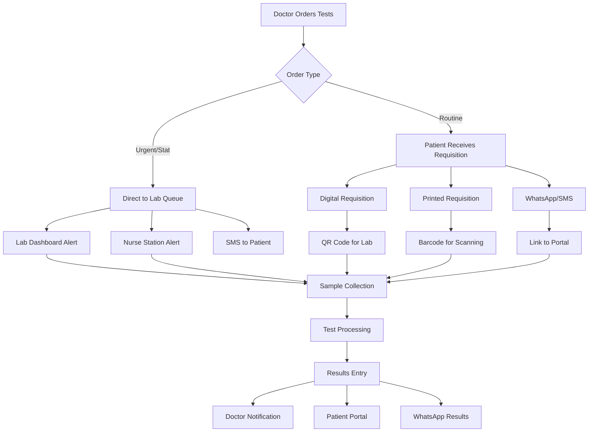

# 🔬 Lab Test Ordering Workflow - Ultra-Deep Analysis

## 🧠 Multi-Stakeholder Perspective Analysis

### 1. **Doctor's Perspective**
**Needs:**
- Quick test ordering during consultation
- Visibility of pending/completed tests
- Results integration with patient record
- Ability to track test status
- Clinical decision support (which tests for which symptoms)

**Pain Points:**
- Forgetting to inform patient about fasting requirements
- Not knowing if patient completed the tests
- Waiting for critical results
- Duplicate test ordering

### 2. **Patient's Perspective**
**Needs:**
- Clear understanding of what tests are ordered
- Instructions for test preparation (fasting, etc.)
- Cost transparency before tests
- Document for insurance claims
- Access to their test results
- Ability to take tests at preferred lab

**Pain Points:**
- Not knowing test requirements
- Surprise costs
- Lost test prescriptions
- Multiple visits for sample collection
- Not understanding why tests are needed

### 3. **Lab Technician's Perspective**
**Needs:**
- Complete patient information
- Clear test requirements
- Sample collection instructions
- Priority/urgency indicators
- Clinical context for accurate testing

**Pain Points:**
- Incomplete requisitions
- Wrong sample collection
- Missing clinical information
- Unclear handwriting (if paper-based)

### 4. **Hospital Administration Perspective**
**Needs:**
- Revenue tracking
- Test utilization analytics
- Turnaround time monitoring
- Quality control
- Inventory management for reagents

**Pain Points:**
- Revenue leakage
- Delayed billing
- Compliance issues
- Patient complaints about process

## 🏥 Indian Healthcare Context

### Unique Considerations:
1. **Multi-tier Lab System:**
   - In-house basic tests (CBC, urine)
   - Outsourced specialized tests (genetic, advanced imaging)
   - Collection centers vs processing labs

2. **Payment Models:**
   - Cash payments (need immediate cost info)
   - Insurance (need proper documentation)
   - Government schemes (specific forms required)
   - Corporate panels (pre-approved test lists)

3. **Regulatory Requirements:**
   - NABL accreditation documentation
   - Consent forms for certain tests
   - Government scheme compliance
   - GST invoicing requirements

## 🔄 Optimal Workflow Design

### Proposed Multi-Channel Approach:



## 📋 Recommended Implementation

### 1. **During Consultation - Test Ordering**

#### A. Order Placement Interface
```typescript
interface LabTestOrder {
  // Core Information
  tests: Test[];
  priority: 'Routine' | 'Urgent' | 'STAT';
  clinicalNotes: string;
  suspectedDiagnosis?: string;
  
  // Patient Instructions
  fastingRequired: boolean;
  specialInstructions: string;
  sampleType: 'Blood' | 'Urine' | 'Stool' | 'Other';
  
  // Logistics
  collectionPoint: 'Lab' | 'Ward' | 'Home';
  preferredLabBranch?: string;
  
  // Financial
  estimatedCost: number;
  paymentMode: 'Cash' | 'Insurance' | 'Scheme';
  
  // Documentation
  includeInPrescription: boolean;
  sendToPatient: boolean;
  generateRequisition: boolean;
}
```

#### B. Multi-Output Generation
When doctor orders tests, system should generate:

1. **Lab Queue Entry** (Direct transmission)
2. **Patient Requisition** (Physical/Digital document)
3. **Prescription Addendum** (Optional inclusion)
4. **Patient Instructions** (SMS/WhatsApp)
5. **Billing Pre-authorization** (If insurance)

### 2. **Enhanced UI Components**

#### A. Test Ordering Section
```typescript
// In ConsultationInterface.tsx - Enhanced Investigations Tab
<TabsContent value="investigations">
  {/* Current Test Ordering */}
  <Card>
    <CardHeader>
      <CardTitle>Order Laboratory Tests</CardTitle>
    </CardHeader>
    <CardContent>
      {/* Existing test selection */}
    </CardContent>
  </Card>

  {/* NEW: Test Requisition Options */}
  <Card className="mt-4">
    <CardHeader>
      <CardTitle>Test Requisition Management</CardTitle>
    </CardHeader>
    <CardContent>
      <div className="space-y-4">
        {/* Delivery Options */}
        <div className="flex items-center space-x-4">
          <Checkbox 
            id="send-to-lab"
            defaultChecked
            disabled
          />
          <Label>Send directly to lab (Always enabled)</Label>
        </div>
        
        <div className="flex items-center space-x-4">
          <Checkbox 
            id="add-to-prescription"
            checked={addTestsToPrescription}
            onCheckedChange={setAddTestsToPrescription}
          />
          <Label>Include in prescription document</Label>
        </div>
        
        <div className="flex items-center space-x-4">
          <Checkbox 
            id="generate-requisition"
            checked={generateRequisition}
            onCheckedChange={setGenerateRequisition}
          />
          <Label>Generate separate lab requisition form</Label>
        </div>
        
        <div className="flex items-center space-x-4">
          <Checkbox 
            id="send-to-patient"
            checked={sendToPatient}
            onCheckedChange={setSendToPatient}
          />
          <Label>Send copy to patient (WhatsApp/SMS)</Label>
        </div>

        {/* Cost Transparency */}
        <Alert>
          <AlertCircle className="h-4 w-4" />
          <AlertTitle>Estimated Cost</AlertTitle>
          <AlertDescription>
            Total: ₹{calculateTestCost(selectedTests)}
            {paymentMode === 'Insurance' && ' (Pre-authorization required)'}
          </AlertDescription>
        </Alert>

        {/* Instructions */}
        <div>
          <Label>Patient Preparation Instructions</Label>
          <Textarea
            placeholder="e.g., Fasting for 12 hours, Morning sample required"
            value={testInstructions}
            onChange={(e) => setTestInstructions(e.target.value)}
          />
        </div>
      </div>
    </CardContent>
  </Card>

  {/* NEW: Pending Tests Monitor */}
  <Card className="mt-4">
    <CardHeader>
      <CardTitle>Test Status Tracker</CardTitle>
    </CardHeader>
    <CardContent>
      <div className="space-y-2">
        {pendingTests.map(test => (
          <div key={test.id} className="flex justify-between items-center p-2 border rounded">
            <div>
              <p className="font-medium">{test.name}</p>
              <p className="text-sm text-gray-600">
                Ordered: {format(test.orderedAt, 'dd/MM HH:mm')}
              </p>
            </div>
            <Badge variant={getStatusVariant(test.status)}>
              {test.status}
            </Badge>
          </div>
        ))}
      </div>
    </CardContent>
  </Card>
</TabsContent>
```

#### B. Prescription Enhancement
```typescript
// Modified Prescription Preview
<Dialog open={showPreviewDialog}>
  <DialogContent className="max-w-4xl">
    <Tabs defaultValue="prescription">
      <TabsList>
        <TabsTrigger value="prescription">Prescription</TabsTrigger>
        <TabsTrigger value="lab-requisition">Lab Tests</TabsTrigger>
      </TabsList>
      
      <TabsContent value="prescription">
        {/* Existing prescription preview */}
        
        {/* NEW: Optional test inclusion */}
        {addTestsToPrescription && labTests.length > 0 && (
          <div className="mt-4 p-3 border-t">
            <h4 className="font-semibold mb-2">Laboratory Tests Advised:</h4>
            <ol className="list-decimal list-inside space-y-1">
              {labTests.map(test => (
                <li key={test.id} className="text-sm">
                  {test.name}
                  {test.instructions && (
                    <span className="text-gray-600 ml-2">
                      ({test.instructions})
                    </span>
                  )}
                </li>
              ))}
            </ol>
            {testInstructions && (
              <p className="text-sm mt-2 italic">
                Note: {testInstructions}
              </p>
            )}
          </div>
        )}
      </TabsContent>
      
      <TabsContent value="lab-requisition">
        {/* NEW: Dedicated lab requisition form */}
        <LabRequisitionForm 
          patient={patientInfo}
          doctor={doctorInfo}
          tests={labTests}
          instructions={testInstructions}
          qrCode={generateQRCode({
            patientId: patientInfo.id,
            orderId: consultationId,
            tests: labTests.map(t => t.id)
          })}
        />
      </TabsContent>
    </Tabs>
    
    <DialogFooter>
      <Button onClick={() => printDocument('prescription')}>
        <Printer className="h-4 w-4 mr-2" />
        Print Prescription
      </Button>
      {generateRequisition && (
        <Button onClick={() => printDocument('lab-requisition')}>
          <Printer className="h-4 w-4 mr-2" />
          Print Lab Form
        </Button>
      )}
      <Button onClick={() => sendDocuments()}>
        <Send className="h-4 w-4 mr-2" />
        Send to Patient
      </Button>
    </DialogFooter>
  </DialogContent>
</Dialog>
```

### 3. **Lab Requisition Form Component**
```typescript
// New component: LabRequisitionForm.tsx
export function LabRequisitionForm({ patient, doctor, tests, instructions, qrCode }) {
  return (
    <div className="p-6 bg-white">
      {/* Header */}
      <div className="text-center border-b pb-4 mb-4">
        <h2 className="text-xl font-bold">LABORATORY TEST REQUISITION</h2>
        <p className="text-sm">Sanjeevani Hospital & Medical Centre</p>
        <p className="text-xs">NABL Accredited Laboratory</p>
      </div>
      
      {/* QR Code for quick scanning */}
      <div className="float-right">
        <QRCode value={qrCode} size={100} />
        <p className="text-xs text-center mt-1">Scan at Lab</p>
      </div>
      
      {/* Patient Details */}
      <div className="mb-4">
        <h3 className="font-semibold mb-2">Patient Information:</h3>
        <div className="grid grid-cols-2 gap-2 text-sm">
          <p>Name: {patient.name}</p>
          <p>Age/Gender: {patient.age}Y/{patient.gender}</p>
          <p>Patient ID: {patient.id}</p>
          <p>Contact: {patient.phone}</p>
        </div>
      </div>
      
      {/* Clinical Information */}
      <div className="mb-4">
        <h3 className="font-semibold mb-2">Clinical Information:</h3>
        <p className="text-sm">Provisional Diagnosis: {diagnosis}</p>
        <p className="text-sm">Clinical Notes: {clinicalNotes}</p>
      </div>
      
      {/* Tests Ordered */}
      <div className="mb-4">
        <h3 className="font-semibold mb-2">Tests Required:</h3>
        <table className="w-full text-sm">
          <thead>
            <tr className="border-b">
              <th className="text-left">Test Name</th>
              <th className="text-left">Sample Type</th>
              <th className="text-left">Special Instructions</th>
              <th className="text-left">Priority</th>
            </tr>
          </thead>
          <tbody>
            {tests.map(test => (
              <tr key={test.id} className="border-b">
                <td className="py-1">{test.name}</td>
                <td>{test.sampleType}</td>
                <td>{test.instructions || '-'}</td>
                <td>
                  <Badge variant={test.priority === 'STAT' ? 'destructive' : 'default'}>
                    {test.priority}
                  </Badge>
                </td>
              </tr>
            ))}
          </tbody>
        </table>
      </div>
      
      {/* Patient Instructions */}
      {instructions && (
        <div className="mb-4 p-3 bg-yellow-50 border border-yellow-200 rounded">
          <h3 className="font-semibold mb-1">Important Instructions:</h3>
          <p className="text-sm">{instructions}</p>
        </div>
      )}
      
      {/* Footer */}
      <div className="mt-6 flex justify-between">
        <div>
          <p className="text-sm">Ordered by: Dr. {doctor.name}</p>
          <p className="text-xs">Reg No: {doctor.regNumber}</p>
        </div>
        <div className="text-right">
          <p className="text-sm">Date: {format(new Date(), 'dd/MM/yyyy HH:mm')}</p>
          <p className="text-xs">Valid for 7 days</p>
        </div>
      </div>
      
      {/* Sample Collection Area (for lab use) */}
      <div className="mt-6 pt-4 border-t border-dashed">
        <p className="text-xs font-semibold">FOR LABORATORY USE ONLY:</p>
        <div className="grid grid-cols-3 gap-4 mt-2">
          <div>
            <p className="text-xs">Sample Collected:</p>
            <div className="border-b border-gray-400 h-6"></div>
          </div>
          <div>
            <p className="text-xs">Collected By:</p>
            <div className="border-b border-gray-400 h-6"></div>
          </div>
          <div>
            <p className="text-xs">Date/Time:</p>
            <div className="border-b border-gray-400 h-6"></div>
          </div>
        </div>
      </div>
    </div>
  );
}
```

### 4. **Database Integration Points**

#### Required API Endpoints:
```typescript
// 1. Create lab order (sent to lab)
POST /api/lab/orders
{
  consultationId,
  patientId,
  doctorId,
  tests: [...],
  priority,
  clinicalNotes
}

// 2. Generate requisition document
POST /api/lab/requisition
{
  orderId,
  format: 'pdf' | 'image',
  includeQR: true
}

// 3. Send to patient
POST /api/notifications/lab-requisition
{
  patientId,
  orderId,
  channels: ['whatsapp', 'sms', 'email'],
  documents: ['requisition', 'instructions']
}

// 4. Track test status
GET /api/lab/orders/:orderId/status

// 5. Cost estimation
POST /api/lab/estimate-cost
{
  tests: [...],
  paymentMode,
  insuranceId?
}
```

## 🎯 Benefits of This Approach

### For Doctors:
✅ Single action creates multiple outputs
✅ Flexibility in documentation
✅ Real-time test tracking
✅ Reduced paperwork

### For Patients:
✅ Multiple ways to access test info
✅ Cost transparency upfront
✅ Clear instructions
✅ Digital and physical options

### For Labs:
✅ Direct electronic orders
✅ Complete clinical context
✅ QR code for quick retrieval
✅ Reduced transcription errors

### For Hospital:
✅ Complete audit trail
✅ Revenue tracking
✅ Reduced disputes
✅ Better compliance

## 📊 Implementation Priority

### Phase 1 (Must Have):
1. ✅ Direct lab transmission (existing)
2. ⭐ Add to prescription option
3. ⭐ Patient instructions field
4. ⭐ Cost display

### Phase 2 (Should Have):
1. ⏳ Separate requisition form
2. ⏳ QR code generation
3. ⏳ WhatsApp/SMS integration
4. ⏳ Test status tracking

### Phase 3 (Nice to Have):
1. ⏳ Multi-lab routing
2. ⏳ Home collection scheduling
3. ⏳ Insurance pre-auth
4. ⏳ Result integration

## 🔧 Technical Considerations

### State Management:
```typescript
// Enhanced state for test ordering
const [labTestOrder, setLabTestOrder] = useState({
  tests: [],
  priority: 'Routine',
  instructions: '',
  
  // Documentation options
  sendToLab: true, // Always true
  includeInPrescription: false,
  generateRequisition: true,
  sendToPatient: true,
  
  // Financial
  estimatedCost: 0,
  paymentMode: 'Cash',
  
  // Logistics
  collectionPoint: 'Lab',
  preferredTime: null
});
```

### Data Flow:
1. Doctor selects tests → Calculate cost
2. Set documentation options → Generate outputs
3. Save order → Send to lab queue
4. Generate documents → Store in patient record
5. Send notifications → Track delivery
6. Monitor status → Update UI

## 💡 Innovative Features

### 1. **Smart Test Suggestions**
Based on symptoms and provisional diagnosis, suggest relevant tests.

### 2. **Test Package Bundles**
Pre-configured test packages (e.g., "Fever Panel", "Diabetes Monitoring").

### 3. **Repeat Test Tracking**
Alert if same test ordered recently, show trending results.

### 4. **Insurance Integration**
Real-time coverage check and pre-authorization.

### 5. **Sample Collection Scheduling**
Allow patients to book collection slots.

## ✅ Final Recommendation

**Implement a hybrid approach** where:

1. **Lab always receives** electronic orders (mandatory)
2. **Prescription can include** test list (optional, default ON for OPD)
3. **Separate requisition** generated (optional, default ON)
4. **Patient receives** digital copy via WhatsApp/SMS (optional, default ON)
5. **Cost transparency** shown always

This provides maximum flexibility while ensuring all stakeholders have the information they need in their preferred format.

---

**Decision**: Implement multi-channel test documentation with smart defaults that can be customized per consultation.