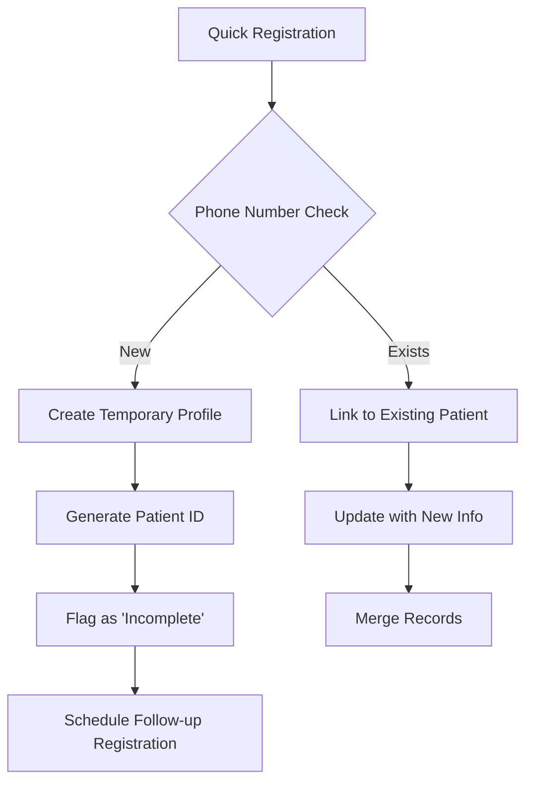

# 🏥 Patient Registration Strategy & Reconciliation

## Overview
The HMS system provides two patient registration pathways to handle different clinical scenarios efficiently.

## Two Registration Pathways

### 1. 📋 Complete Patient Registration (Primary)
**Location**: `/dashboard/patients/new`

**Purpose**: Comprehensive patient onboarding with full medical history

**When to Use**:
- Planned hospital visits
- First-time patients with time for complete registration
- When insurance verification is needed
- When complete medical history is required

**Data Collected**:
- **Personal Information**: Full name, DOB, gender, blood group
- **Identification**: Aadhaar (12-digit), ABHA ID, Photo ID
- **Contact Details**: Phone, email, complete address
- **Emergency Contact**: Name, phone, relationship
- **Medical History**: 
  - Allergies
  - Chronic conditions
  - Current medications
  - Previous surgeries
  - Family medical history
- **Insurance Details**:
  - Provider name
  - Policy number
  - Valid till date
  - Coverage type
- **Lifestyle Information**: Smoking, alcohol, dietary restrictions

**Benefits**:
- Complete patient profile for better care
- Insurance pre-authorization possible
- Medical history available for clinical decisions
- Emergency contacts readily available

### 2. ⚡ Quick Registration (During Appointment Booking)
**Location**: Within appointment booking dialog

**Purpose**: Minimal registration for walk-in and emergency patients

**When to Use**:
- Walk-in patients needing immediate care
- Emergency situations
- When patient is in distress
- Time-critical consultations

**Data Collected** (Minimum Required):
- **Basic Info**: First name, last name
- **Contact**: Phone number (10-digit)
- **Optional Quick Fields**:
  - Email
  - Date of birth
  - Gender
  - Aadhaar number

**Benefits**:
- Fast patient onboarding (< 1 minute)
- No delay in medical care
- Can start consultation immediately
- Details can be completed later

## Reconciliation Strategy

### Automatic Linking System



### Implementation Details

#### 1. **Unique Patient Identification**
```typescript
// Primary Keys (in order of priority)
1. Aadhaar Number (if available)
2. ABHA ID (if available)
3. Phone Number + Name combination
4. System-generated Patient ID
```

#### 2. **Data Merge Rules**
When a quick-registered patient returns for complete registration:

| Field | Merge Strategy |
|-------|----------------|
| Name | Keep complete registration version |
| Phone | Update if different, keep history |
| Aadhaar | Add to profile (unique constraint) |
| Medical History | Append new information |
| Appointments | Link all to single profile |
| Billing | Consolidate under one account |

#### 3. **Profile Completion Tracking**
```typescript
interface PatientProfile {
  registrationStatus: 'Complete' | 'Partial' | 'Emergency';
  completionPercentage: number; // 0-100
  missingFields: string[];
  lastUpdated: Date;
}
```

### Database Schema Support

```sql
-- Patients table has fields for both pathways
CREATE TABLE patients (
  patient_id UUID PRIMARY KEY,
  -- Quick registration fields (required)
  first_name VARCHAR(100) NOT NULL,
  last_name VARCHAR(100) NOT NULL,
  phone VARCHAR(15) NOT NULL,
  
  -- Complete registration fields (nullable)
  aadhaar_number VARCHAR(12) UNIQUE,
  abha_id VARCHAR(20) UNIQUE,
  email VARCHAR(100),
  date_of_birth DATE,
  blood_group VARCHAR(5),
  
  -- Registration metadata
  registration_type ENUM('Complete', 'Quick', 'Emergency'),
  registration_completed BOOLEAN DEFAULT FALSE,
  created_via VARCHAR(50), -- 'PatientForm' or 'AppointmentBooking'
  
  -- Timestamps
  created_at TIMESTAMP,
  updated_at TIMESTAMP
);

-- Track registration completions
CREATE TABLE registration_tasks (
  task_id UUID PRIMARY KEY,
  patient_id UUID REFERENCES patients(patient_id),
  pending_fields JSONB,
  due_date DATE,
  completed_at TIMESTAMP,
  completed_by UUID REFERENCES users(user_id)
);
```

## Workflow Examples

### Scenario 1: Walk-in Patient (First Visit)
1. **Reception** uses "Walk-in Appointment" button
2. **Quick Registration** with name and phone
3. **Token generated**, patient sent to doctor
4. **During consultation**, nurse can add vital signs
5. **After consultation**, reception completes full registration
6. **System links** all records to single patient profile

### Scenario 2: Emergency Patient
1. **Emergency staff** books appointment immediately
2. **Minimal info** captured (name if conscious)
3. **Treatment begins** with temporary ID
4. **Family arrives**, provides complete details
5. **System merges** temporary and complete profiles
6. **Billing consolidated** under single account

### Scenario 3: Regular Patient Booking
1. **Patient calls** for appointment
2. **Reception searches** by phone/name
3. If found → **Book appointment** directly
4. If not found → **Complete registration** first
5. **Profile marked** as complete
6. **No reconciliation** needed

## Benefits of Dual System

### For Patients
- ✅ No delay in receiving care
- ✅ Flexibility in registration timing
- ✅ Emergency care without paperwork
- ✅ Complete profile when time permits

### For Hospital Staff
- ✅ Reduced queue at reception
- ✅ Handle emergencies efficiently
- ✅ Complete data collection over time
- ✅ Flexibility in patient flow

### For Hospital Management
- ✅ Improved patient satisfaction
- ✅ Better emergency response
- ✅ Complete data for analytics
- ✅ Regulatory compliance maintained

## Best Practices

### Reception Staff Guidelines
1. **Use Complete Registration** when:
   - Patient has appointment
   - Not urgent situation
   - Insurance verification needed
   - First planned visit

2. **Use Quick Registration** when:
   - Walk-in with symptoms
   - Emergency/urgent care
   - Patient in distress
   - Long queue at reception

### Data Quality Measures
1. **Daily Review**: List of incomplete registrations
2. **Follow-up Calls**: Complete missing information
3. **Next Visit Update**: Prompt for missing fields
4. **Quality Metrics**: Track completion rates

### System Safeguards
1. **Duplicate Prevention**: Check phone + name before creating new
2. **Merge Capability**: Admin can merge duplicate profiles
3. **Audit Trail**: Track all registration changes
4. **Data Validation**: Ensure Aadhaar/ABHA uniqueness

## Technical Implementation

### API Endpoints
```typescript
// Quick Registration
POST /api/patients/quick-register
{
  firstName: string;
  lastName: string;
  phone: string;
  email?: string;
  registeredVia: 'AppointmentBooking';
}

// Complete Registration
POST /api/patients/register
{
  ...completePatientData,
  registeredVia: 'PatientForm';
}

// Link/Merge Profiles
POST /api/patients/reconcile
{
  quickRegistrationId: string;
  completeRegistrationId: string;
  mergeStrategy: 'auto' | 'manual';
}

// Get Incomplete Registrations
GET /api/patients/incomplete
Returns: Patient[] with registrationStatus: 'Partial'
```

### UI Indicators
- 🟢 **Green Badge**: Complete registration
- 🟡 **Yellow Badge**: Partial registration (quick)
- 🔴 **Red Badge**: Emergency registration (minimal)
- 📋 **Clipboard Icon**: Registration pending completion

## Metrics & Monitoring

### Key Metrics to Track
1. **Registration Completion Rate**: % of quick registrations completed within 7 days
2. **Duplicate Rate**: Number of duplicate profiles created
3. **Merge Success Rate**: Successful automatic merges
4. **Time to Complete**: Average days from quick to complete registration

### Monthly Reports
- Total quick registrations
- Total complete registrations
- Pending completions
- Successful merges
- Data quality score

## Conclusion

The dual registration system provides flexibility while maintaining data integrity. Quick registration ensures no patient is turned away due to paperwork, while the complete registration pathway ensures comprehensive medical records for optimal care delivery.

**Key Principle**: Patient care first, paperwork later (but still important)!